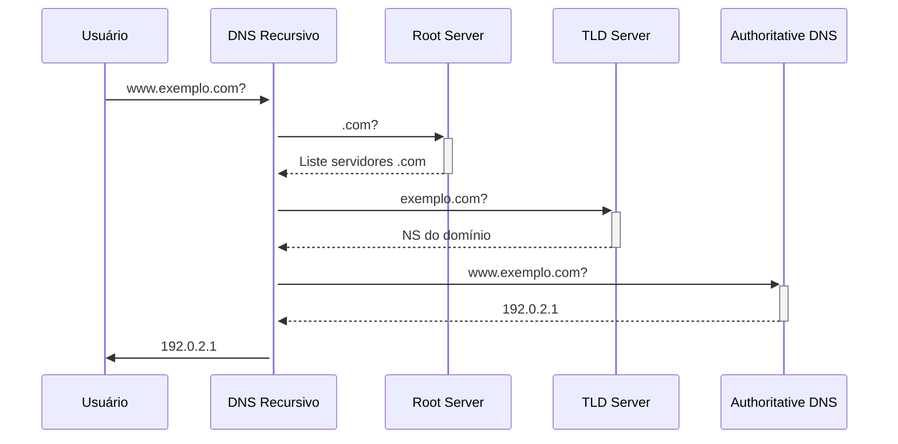

# 🌐 DNS (Domain Name System) - Sistema de Nomes de Domínio

## 🔍 Definição Básica
O **DNS** é o "catálogo telefônico da Internet" que traduz:
- Nomes de domínio legíveis (ex: `google.com`) → **Endereços IP** (ex: `142.250.218.46`)
- Estrutura hierárquica e distribuída globalmente

## ⚙️ Como Funciona (Fluxo Simplificado)


## 📌 Componentes Principais
1. Root Servers (13 grupos globais)
2. TLD Servers (gerenciam .com, .br, etc)
3. Authoritative DNS (dono do domínio)
4. DNS Recursivo (do seu provedor)

## 💡 Para Que Serve?
✅ Navegação Web: Acessar sites por nomes
✅ E-mails: Roteamento de mensagens
✅ CDNs: Distribuição geográfica de conteúdo
✅ Segurança: DNSSEC, filtragem de malware

## 🛠️ Comandos Úteis (Linux)
```bash 
# Consulta básica
dig exemplo.com

# Consulta reversa (IP → nome)
dig -x 192.0.2.1

# Verificar servidores DNS do domínio
host -t ns exemplo.com

# Testar resolução DNS local
nslookup exemplo.com
```

## 🔒 DNS Seguro (DNSSEC)
Protege contra:
-Spoofing de DNS
-Ataques man-in-the-middle
-Cache poisoning

## 🌍 Tipos de Registros DNS

| Tipo   | Finalidade               | Exemplo                                      |
|--------|--------------------------|---------------------------------------------|
| A      | Mapeamento para IPv4     | `exemplo.com → 192.0.2.1`                   |
| AAAA   | Mapeamento para IPv6     | `exemplo.com → 2606:4700::`                 |
| MX     | Servidores de e-mail     | `10 mail.exemplo.com`                       |
| CNAME  | Apelido/alias            | `www → exemplo.com`                         |
| TXT    | Verificações/SPF/DMARC   | `"v=spf1 include:_spf.google.com ~all"`     |
| NS     | Servidores DNS           | `exemplo.com → ns1.hospedagem.com`          |
| SOA    | Informações de autoridade | `ns1.exemplo.com admin.exemplo.com 2023080101` |
| PTR    | Consulta reversa         | `1.2.0.192.in-addr.arpa → servidor.exemplo.com` |
| SRV    | Serviços específicos     | `_sip._tcp.exemplo.com → 5060 sip.exemplo.com` |
| CAA    | Autoridade de certificados| `exemplo.com → 0 issue "letsencrypt.org"`   |

