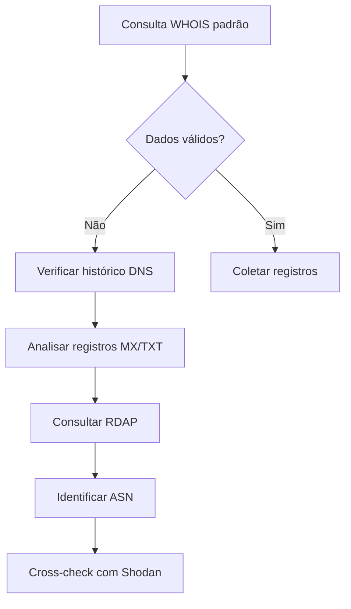

# 🕵️ Comando WHOIS: Conceito e Aplicações Práticas

## 🔍 O que é o comando WHOIS?

WHOIS é um protocolo de consulta que fornece informações sobre:
- **Domínios registrados** (dono, data de criação, contatos)
- **Blocos de IP** (provedor responsável, localização)
- **Sistemas Autônomos** (ASN)

**Sintaxe básica**:
```bash
whois [domínio|IP|ASN]
```
**Trazer bloco de ip e ASN**
```bash
whois 37.59.174.255 | egrep "inetnum|aut-num"
```



OBS: Sempre confirme a bloco de ip na ARIN (https://search.arin.net/), pois a saída do comando whois para inetnum pode conter valores desatualizados. 