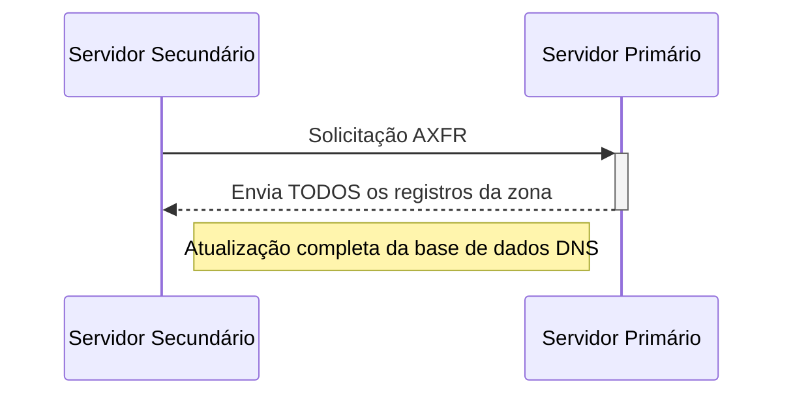

# 🔄 Transferência de Zona DNS (DNS Zone Transfer)

## 🔍 Definição
A **transferência de zona DNS** (AXFR - *Authoritative Zone Transfer*) é um mecanismo que permite a replicação de registros DNS completos de um servidor DNS primário (master) para servidores secundários (slaves).

## ⚙️ Como Funciona
